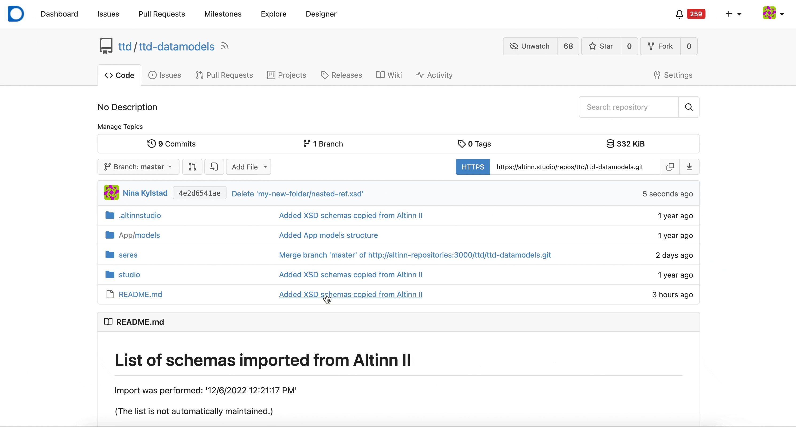

## What You'll Learn

This guide shows you how to use the Altinn Studio Data Modeling tool to:
- Upload existing XSD data models
- Create new data models from scratch
- Edit and manage data model fields and types
- Generate model files for your application

## Prerequisites

- Access to Altinn Studio
- Membership in an organization (required for uploading models)
- Basic understanding of [data model concepts](/en/altinn-studio/v8/reference/data/data-model-files/)

## Navigate to the Data Modeling Tool

{}

## Upload an Existing XSD Data Model

If you have an existing XSD data model, you can upload it to generate the required JSON Schema and C# files.

{}
You must be a member of an organization to upload data models.
{}

### Steps

1. Click **Last opp datamodell** (Upload Data Model) if no models exist, or **Last opp** (Upload) from the toolbar.
2. Select an XSD file (`.xsd`) from your computer.
3. Click **Last opp** (Upload).

The tool will process the file and generate:
- JSON Schema file (`<model>.schema.json`)
- C# model file (`<model>.cs`)

These files will be stored in `App/models/` in your repository.

### View the Model

After upload, the data model appears in the tool:
- Types are listed in the left panel
- A tree view shows the model structure and fields
- Click on fields to see their properties

## Upload XSD Directly to Repository

If you only want to store XSD files without editing them in the tool:

1. Navigate to your `<org>-datamodels` repository in Gitea.
2. Navigate to the desired folder.
3. Select **Add file** → **Upload file**.
4. (Optional) Enter a folder name in the text field.
5. Upload the XSD file.
6. (Optional) Add a commit message.
7. Click **Commit changes**.

## Select a Model to Work With

Use the dropdown list in the toolbar to select which model to edit.

{}

## Create a New Data Model

To start from scratch without uploading an XSD:

1. Click **Lag ny** (Create new) on the toolbar.
2. Enter a name for the data model.
3. Click **Opprett modell** (Create model).

The tool creates a new model with example fields:
- `property1` (text, required)
- `property2` (text, required)
- `property3` (text)

You can edit or delete these fields as needed.

## Edit a Data Model

Select the model from the dropdown list to begin editing.

{}
JSON Schema changes are **auto-saved** as you work. To generate XSD and C# files, click **Generer modeller** (Generate Models).
{}

### Add a Field at the Root Level

1. Click **Legg til** (Add) at the top of the tree view.
2. Configure the field properties in the right panel.

### Add a Subfield

To add fields inside an Object type:

1. Click the **+** button next to the parent field, or
2. Click the parent field and select the **Felter** (Fields) tab in the right panel.
3. Click **Legg til** (Add).

{}
Subfields can only be added to fields of type **Object**.
{}

### Add a Custom Type

Custom types let you define reusable structures:

1. Click the **+** sign in the "Typer" (Types) panel on the left.
2. Name the type.
3. Add fields to the type.

### Convert a Field to a Type

If you want to reuse a field structure:

1. Click the reference icon to the right of the field.
2. The field becomes a reusable custom type.

### Edit a Type

1. Select the type from the left panel.
2. The tree view shows the type's structure.
3. Edit properties in the right panel.
4. Add fields using the **Legg til** button.
5. Click **Tilbake til datamodell** (Back to data model) when done.

### Delete a Type

1. Select the type from the left panel.
2. Click the delete button on the root node of the type.

{}
You cannot delete types that are currently in use by fields.
{}

## Work with Type References

Type references let you reuse custom type structures across your model.

### What is a Type Reference?

A type reference is a field that follows the structure of a custom type. For example:

- Type `Address` has: `StreetName`, `PostalCode`, `Location`
- Adding an `Address` reference automatically includes all three fields
- The type name appears next to the field in the tree view

### Add a Type Reference

**Drag and drop:**
1. Drag a type from the left panel into the tree view.
2. This creates a new field with that type structure.

**As a subfield:**
- Drag the type into an existing Object field.

### Delete a Field

Click the delete button to the right of the field in the tree view.

### Edit Field Properties

1. Click the field in the tree view.
2. Properties appear in the right panel.
3. Edit as needed (available properties vary by field type).

## Advanced: XSD Attributes and Namespaces

The following must be edited manually in the JSON Schema or XSD files:

- `dataFormatId` and `dataFormatVersion`
- XSD attributes
- XSD namespaces

See these guides for details:
- [dataFormatId and dataFormatVersion](/altinn-studio/guides/altinn-2/altinn-2-datamodel/#dataformatid-og-dataformatversion)
- [XSD attributes](/altinn-studio/guides/altinn-2/altinn-2-datamodel/#xsd-attributter)
- [XSD namespaces](/altinn-studio/guides/altinn-2/altinn-2-datamodel/#xsd-namespaces)

## Generate Model Files

After editing your JSON Schema, generate the XSD and C# files:

1. Click **Generer modeller** (Generate Models) in the toolbar.
2. Wait for processing to complete.
3. Files are created in `App/models/`.

{}
Remember to click **Del dine endringer** (Upload your changes) in the main Altinn Studio menu to save your changes to the central repository.
{}

## Download an XSD File

To download a generated XSD file:

1. Click the person icon in the top right corner.
2. Select **Open repository**.
3. Navigate to `App/models/`.
4. Find your `<model>.xsd` file.
5. Click the download icon.

## Troubleshooting

### Model Doesn't Appear in Dropdown

- Verify the model files are in `App/models/` folder
- Try refreshing the page
- Check if you have access to the repository

### Can't Delete a Type

The type is being used by one or more fields. Remove all references to the type before deleting it.

### Changes Not Saving

- JSON Schema changes auto-save
- Click "Generate Models" to update XSD and C# files
- Use "Upload your changes" to push to central repository

## Related Documentation

- [Data Model Files Reference](/en/altinn-studio/v8/reference/data/data-model-files/)
- [Known Issues](https://github.com/orgs/Altinn/projects/1/views/10)
- [Planned Features](https://github.com/orgs/Altinn/projects/1/views/6)
- [Altinn 2 Data Model Migration](/en/altinn-studio/v8/guides/altinn-2/altinn-2-datamodel/)
- [Seres Migration](/en/altinn-studio/v8/guides/altinn-2/seres-migration/)